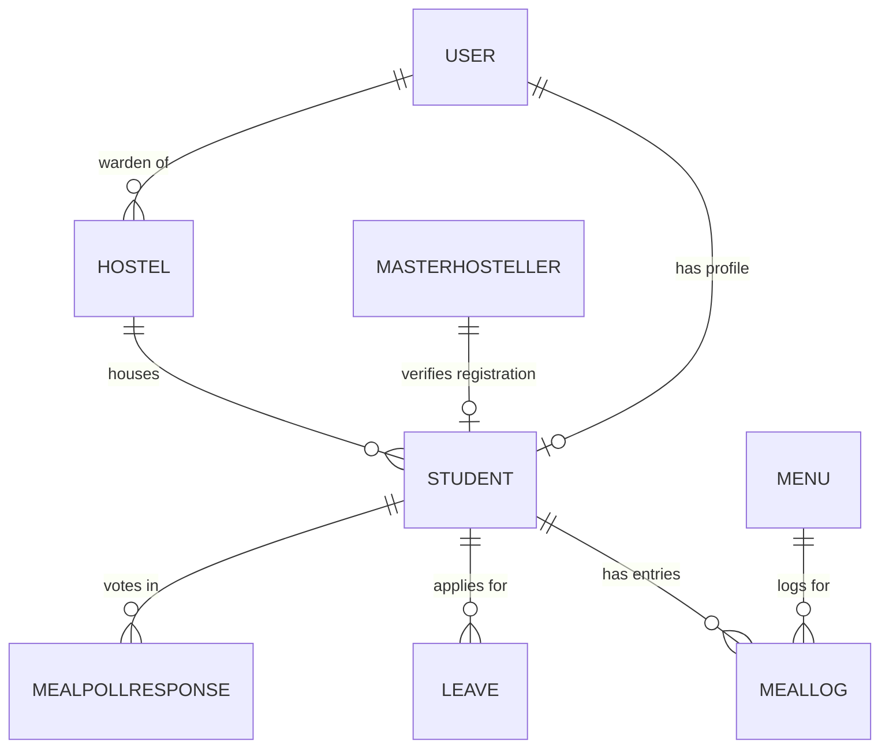

# FOOD-DO Technical & System Architecture Overview

**FOOD-DO** is a real-time, smart hostel mess attendance, menu management, and dietary optimization platform. The system uses dynamic, time-rotating QR codes to eliminate proxy attendance, sends automated parent SMS notifications, reduces meal wastage via pre-meal student polling and leave tracking, and streams real-time gate terminal activity via WebSockets.

---

## 1. Monorepo Architecture Overview

The repository is structured as an **NPM Monorepo** containing the backend infrastructure, web applications, and mobile application setup:

```
FOOD-DO site/
├── backend/            # Express, TypeScript, Prisma ORM, Socket.io REST API
├── student-portal/     # React 19 + Vite Mobile-First Student Web App
├── admin-portal/       # React 19 + Vite Warden & Staff Administration App
├── mobile/             # Flutter (Dart) Cross-Platform Mobile Application Shell
├── docker-compose.yml  # Containerized PostgreSQL & Redis Infrastructure
└── package.json        # Workspace orchestration scripts
```

---

## 2. Backend Infrastructure (`backend/`)

### Tech Stack & Core Dependencies
- **Runtime & Language**: Node.js with TypeScript (`tsx`, `ts-node`)
- **Web Framework**: Express.js with CORS and JSON body parsing
- **Database & ORM**: PostgreSQL managed via **Prisma ORM**
- **Caching & Infrastructure**: Redis (Dockerized), Docker Compose
- **Real-Time Communication**: **Socket.io** (Bi-directional WebSocket server)
- **Security & Authentication**: JSON Web Tokens (`jsonwebtoken`), Passwords hashed via `bcrypt` / `crypto`
- **SMS Gateway**: Fast2SMS (India Bulk SMS API) & Twilio integration with automatic fallback simulation
- **Job Scheduler**: `node-cron` for automated weekly parent report dispatches

---

### Database Schema & Models (`prisma/schema.prisma`)



| Model | Description & Key Fields |
| :--- | :--- |
| **`User`** | Auth credentials (`email`, `phone`, `passwordHash`), role-based permissions (`STUDENT`, `STAFF`, `WARDEN`, `ADMIN`), and account active status. |
| **`Student`** | Detailed student profiles (`rollNumber`, `name`, `hostelId`, `roomNumber`, `foodPreference`, `parentPhone`, `parentEmail`, `mess`). |
| **`Hostel`** | Hostel details (`name`, `capacity`) linked to its assigned warden (`User`). |
| **`Menu`** | Meals served on specific dates (`serveDate`, `mealType`: `BREAKFAST`, `LUNCH`, `DINNER`, `SNACK`, JSON `items` list, `totalCalories`, `isReady` flag). |
| **`MealLog`** | Gate scan audit logs (`studentId`, `menuId`, `entryTime`, `exitTime`, `status`: `CONSUMED` \| `SKIPPED`, `scannerId`). |
| **`Leave`** | Out-of-hostel leave requests (`startDate`, `endDate`, `status`: `PENDING` \| `APPROVED` \| `REJECTED`). Excuses students from meal sessions. |
| **`MasterHosteller`** | Official campus registry table (`rollNumber`, `name`, `hostelName`, `roomNumber`) used during student self-registration to verify legitimate hostellers. |
| **`MealPollResponse`** | Daily pre-meal voting responses (`studentId`, `mealType`, `date`, `preference`: `VEG` \| `NON_VEG` \| `SKIPPING`). |

---

### Dynamic Anti-Proxy QR Security

To prevent screenshots, screen recordings, or proxy attendance sharing:
1. **30-Second Rolling HMAC**: Generates an SHA-256 HMAC token built using `studentUserId + current30SecTimeEpoch + QR_SECRET`.
2. **Scanner Verification**: Upon scan at the mess gate terminal, the backend recalculates the token for both the current and immediately preceding time windows (accounting for minor latency).

---

### Key Backend Systems & Flow Logic

1. **Gate Terminal Entry & Exit Scans (`mealController.ts`)**:
   - **ENTRY Gate**: Verifies the student isn't already checked in (missing exit scan) or hasn't consumed the meal session. Creates a `MealLog` entry, triggers real-time parent SMS alerts, and broadcasts a `meal_scanned` WebSocket event.
   - **EXIT Gate**: Finds active entry log, calculates total dining duration (minutes), updates `exitTime`, and sends exit SMS notification to parents.
2. **Parent SMS Router (`utils/sms.ts`)**:
   - Dispatches live transactional SMS via **Fast2SMS** API or **Twilio** to parent mobile numbers upon mess entry/exit.
   - Falls back to structured console alerts in local dev mode.
3. **Automated Parent Reports (`utils/cronScheduler.ts`)**:
   - Node-cron task scheduled every **Sunday at 8:00 PM** (`0 20 * * 0`) to compile and dispatch weekly dining summaries to parents.
4. **Pre-Meal Dietary Polling (`pollController.ts`)**:
   - Time-windowed polls for upcoming meals (Breakfast, Lunch, Dinner). Enables mess management to forecast exact dietary demands and minimize food waste.

---

### REST API Endpoints Summary

```
/api/auth
  POST   /register          - Student registration verified against MasterHosteller registry
  POST   /login             - Authenticate user, issue JWT with user metadata
  GET    /profile           - Retrieve authenticated user profile with relation data

/api/meals
  GET    /generate-qr       - Obtain short-lived dynamic SHA-256 QR token (30s lifetime)
  POST   /scan              - Gate scanner terminal endpoint for ENTRY / EXIT validation
  GET    /student-attendance - Retrieve student attendance history, metrics, & 30-day heatmap

/api/menus
  POST   /                  - Create meal menu for a date & meal type
  GET    /                  - List all past and upcoming menus
  PUT    /:id/ready         - Set menu ready status and broadcast "Food Ready" notification

/api/leaves
  POST   /apply             - Student submits out-of-hostel leave application
  GET    /student           - Get authenticated student's leave applications
  GET    /all               - Admin/Warden view of all student leave applications
  PUT    /:leaveId/approve  - Approve or Reject student leave application

/api/polls
  GET    /active            - Get active meal window polling state for student
  POST   /submit            - Submit dietary preference (VEG / NON_VEG / SKIPPING)
  GET    /summary           - Aggregated poll statistics for staff forecasting

/api/analytics
  GET    /dashboard         - Dashboard KPIs (total students, meals served today, active leaves, estimated wastage %)

/api/users
  GET    /                  - List system users
  DELETE /:id               - Admin permanent user deletion mechanism
```

---

## 3. Frontend & Client Applications

### A. Student Portal (`student-portal/`)
- **Tech Stack**: React 19, Vite, TypeScript, Tailwind CSS, Lucide React, Framer Motion, Socket.io-client.
- **Key Capabilities**:
  - **Authentication Deck**: Onboarding, Login, Multi-step Signup with Mess selection, Password Recovery (OTP + Reset).
  - **Dynamic QR Identity Pass**: Visual QR code auto-refreshing every 30 seconds with animated countdown ring.
  - **Live Menu & Toast Alerts**: View daily meal menus (Breakfast, Lunch, Dinner, Snack) with real-time "Food is Ready" notification popups received over Socket.io.
  - **Meal Poll Modal**: Interactive popup prompting students to state their attendance intention (Veg, Non-Veg, or Skipping) prior to meal times.
  - **Leave Management**: Apply for leaves to avoid unexcused absences and pause mess billing.
  - **Meal Status & High-Visibility Timings**: Real-time visual cards for Breakfast, Lunch, and Dinner featuring high-contrast timing badges (`7:00 AM Entry Check`, `2:00 PM Entry Check`, `8:30 PM - 10:00 PM`), distinct status indicators, and full WCAG accessibility.
  - **Attendance Analytics**: 30-day visual heatmap, meal attendance percentage, streak counter, and entry/exit timeline.

---

### B. Admin & Warden Portal (`admin-portal/`)
- **Tech Stack**: React 19, Vite, TypeScript, Tailwind CSS, Lucide React, Socket.io-client.
- **Key Capabilities**:
  - **Analytics Dashboard**: Real-time KPI counters tracking total hostellers, active leaves, meals served today, and calculated percentage of food wastage.
  - **Gate Terminal (`/staff-terminal`)**:
    - Scanner terminal UI for staff at mess entry/exit gates.
    - Integrated webcam video feed and physical barcode/QR hardware scanner support.
    - Real-time live activity log powered by WebSockets showing student photos, roll numbers, gate modes, and SMS delivery statuses.
  - **Menu Management Console**: Publish upcoming daily menus, set caloric values, edit dish details, and send "Food Ready" alerts to student devices.
  - **Student & User Management**: Admin panel to assign hostellers to specific messes, edit profile details, toggle active access status, or permanently remove accounts.
  - **Leave Approval Hub**: Warden dashboard to review pending student leave applications and approve/reject requests.

---

### C. Mobile Application (`mobile/`)
- **Tech Stack**: Flutter (Dart SDK `>=3.0.0 <4.0.0`), `qr_flutter`, `http`, `shared_preferences`.
- **Purpose**: Mobile client shell designed for cross-platform iOS and Android deployment, providing native QR generation and push notifications.

---

## 4. Development & Operational Commands

```bash
# Start all 3 local development servers concurrently (Backend on :3000, Portals on Vite ports)
npm run dev

# Start individual modules
npm run dev:backend         # Runs backend API with ts-node
npm run dev:student-portal # Runs student web app
npm run dev:admin-portal   # Runs admin web app

# Start database infrastructure via Docker
docker-compose up -d       # Launches PostgreSQL (5432) & Redis (6379)
```
